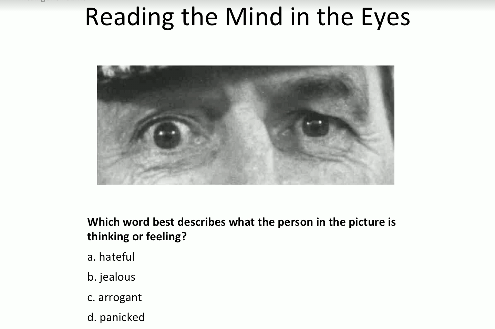

Psycological Safety
===================

Se ha demostrado que algunos grupo de personas inteligentes, como grupo se comportan de forma estúpida o poco inteligente. (Inteligencia Colectiva)

La inteligencia colectiva esta relacionado con:
  - Percepción social (Empatía)
  - Equilibrio en la toma de turnos de conversación - Equality in conversational turn-taking (Psychological Safety - Salud psicológica)
  - Diversidad de género

Empathy
-------

Resources to read:
- Reading the mind in the eyes (Baron-Cohen et al., 2001)
- Five-factor personality analysis (McCrae and Costa, 2008)

Test of empathy: Reading the mind in the eyes.

Características de buenos tests:
- Validity es testear que el test testea lo que tiene que testear
- Re-test reliability: probar que el test da los mismo resultados en un período de tiempo, dos semanas, un mes, ...
