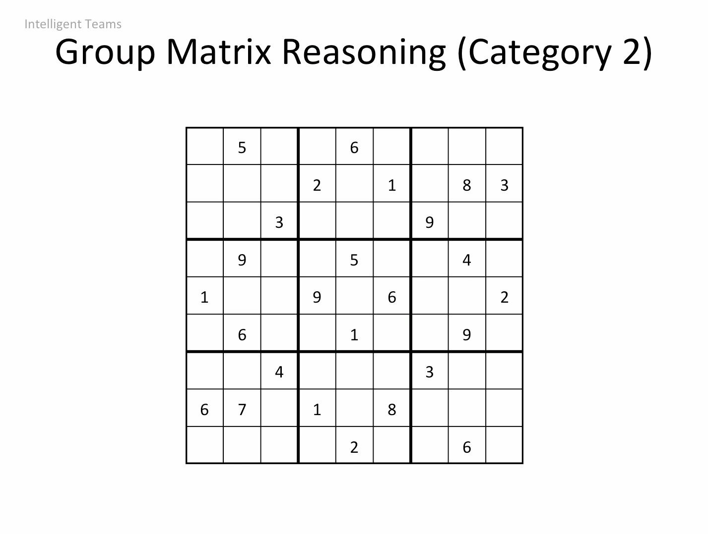

Índice
========
- Intro
- Presentar la inteligencia colectiva
  - Test empatía
  - Test equidad en turnos de palabra (sin decir qué es realmente)
- Psicological Safety
  - Definición
  - Preguntas y tertulia
  - Acciones y dinámica para obtenerlas

Intro
======

Quizás penséis que venis aquí a una tertulia sobre riesgos laborales o que vamos a tratar temas de conflictos en equipos pero aunque tiene que ver no es el caso exacto por el que estamos aquí.

Presentar la inteligencia colectiva
=====================================

Habitualmente se dan casos de equipos donde los integrantes son inteligentes individualmente, afrontan las dificultades con éxito, pero como equipo se comportan de forma poco inteligente, es decir, no non capaces de hacer frente a los problemas en conjunto. A eso se le llama inteligencia colectiva.

La inteligencia colectiva esta relacionada con:
  - Percepción social (Empatía)
  - Equilibrio en la toma de turnos de conversación - Equality in conversational turn-taking (Psychological Safety - Salud psicológica)
  - Diversidad de género

Test de empatía
-----------------

    

Test de equidad de palabra
-------------------------

*(Tests para el turn taking no decir el objetivo, presentarles los disintos tests y ver como se comportan si hablan entre ellos a mitad de tests hacer comentario sobre lo que se esperaba y ver si mejoran en los tiempos. Habría que conometrar los tiempos de participación de cada uno.)*

    

    

¿Psycological Safety?
=====================

Definición
-----------

De las muchas definiciones que tiene este término relativamente moderno, hay una que nos gusta especialmente.

"Cuando los miembros del equipo están motivados en el trabajo y quieren compartir una idea para mejorar el rendimiento, frecuentemente no hablan porque sienten miedo de lo que puedan ser duramente juzgados. Cuando la seguridad psicológica está presente, los miembros del equipo piensan menos sobre las potenciales consecuencias negativas de expresar una idea nueva o diferente que de otra manera. Como resultado, ellos hablan más cuando se sienten psicológicamente seguros y están motivados a mejorar su equipo o empresa"

Podemos decir por tanto que la seguridad psicocógica es el acto de sentir la aceptación, reconocimiento y protección de las personas dentro del equipo. Esto produce que se respete el turno de palabra, las ideas, todos se sientan cómodos dentro del equipo, y los debates y diferencias puedan darse sin llegar a un conflicto.

Preguntas y tertulia: introducción
---------------------------------

- ¿Crees que es útil?

  - Ciclo de la desilusión. Una persona siente 27 emociones a la hora. Esto está ligado a lo complejo que es gestionar las emociones y más en el ciclo de la desilusión. En este ciclo los miembros del equipo se pasan el 90% del tiempo trabajando dura para conseguir un logro. Después de lograr un objetivo nos aderimos a él ya que nos hace felices y aumenta nuestra seguridad, esto ocurre el 10% del tiempo. Por lo cual la mayor parte del tiempo estamos intentando conseguir un logro para poder sentirnos felices y mantener esa seguridad. Esto puede comvertirse en un estado de insatisfacción. ¿Cómo en este contexto podemos sentir que un equipo es propiamente seguro? Focalizándonos en ese 10% de caminos alternativos.
  No hay que buscar la seguridad en otros. Es tiempo de resistencia, persistencia y bravura. Somos parte de una industria revolucionaria donde todo está cambiando y todo tiene interdependencia.
  
- ¿Es aplicable?

Preguntas y tertulia: consecuencias
-----------------------------------

- ¿Que medidas se os ocurre para aumentarla?

  - Countinuos delivery = continuos colaboration -> Mejora de la seguridad psicológica
  - Los líderes podrían mejorar la seguridad psicológica a través de la gestión de la participación y la gestión de la inclusión. También una estructura clara de los miembros donde cada uno entiende su role en el equipo y fuertes relaciones entre ellos es importante para lograr esa seguridad.
  - Cada miembro del equipo debe de saber todo, de forma que pueda responder rápidamente y bien a las preguntas, es por ello que necesitan colaborar. Una persona no sabe todo.
  - https://blog.impraise.com/360-feedback/what-is-psychological-safety-and-why-is-it-the-key-to-great-teamwork-performance-review
  
- ¿Qué puede disminuirla?

  - El fenómeno de la fatiga. La perfección es dificil de conseguir. Estamos en un mundo en constante cambio en el que nunca tenemos suficiente tiempo para terminar algo. Todo está en un constante estado de cambio, no se trata del "yo" si no del ecosistema entero (interdependencia) y siempre estamos en una batalla por combatir la insatisfacción. 
  - En todo este entorno la visión "insight" es el nuevo diferenciador, el nuevo diferenciador de mercado, conseguir esa visión de hacer las cosas en base a las interrelacciones entre miembros de un equipo.
  - Es bueno aumentar la interacción, pero si no gestionamos esto correctamente se puede producir la fatiga de la colaboración, la fatiga de la toma de decisiones y la fatiga en la empatía.
  - Hay juegos peligrosos como el (blame game) "y tú más", echar la culpa al de al lado.
  
- ¿Qué ventajas le ves?

  - Mejora la probabilidad de que las innovación sea satisfactoria y se consigan objetivos.
  - Mejora la capacidad de los miembros de aprender de sus errores.
  - Aumenta la innovación del equipo.
  - Mejora las ganas de los miebros de pertenecer a un equipo.
  - Hace que un equipo sea dinámico y mucho más creativo.
 
- ¿Qué desventajas le ves?

  - Google hizo ciertas investigaciones sobre cómo construir buenos equipos. Se concluyó que la seguridad psicológica es importante y hay que consegirla. En ocasinoes miembros con gran seguridad se sienten en el derecho de comportarse mal, ello puede hacer que el resto del equipo vaya en su mismo camino. Es por ello que un clima que ayuda a que los equipos hagan su mejor trabajo no tiene que ser la cura para todas las enfermedades no éticas o malos comportamientos. 

Preguntas y tertulia: evaluación
--------------------------------
- ¿Crees que tienen seguridad piscológica los equipos?
- ¿Crees que con la seguridad piscológica basta? -Choques entre equipos-

Acciones y dinámica para conseguirlas
-------------------------------------
Sabemos qué es la seguridad psicológica y cómo afecta a los equipos. Durante las pruebas hemos tomado ciertas métricas para determinar si la seguridad psicológica está presente.
Vamos a proponer una dinámica para llegar a conclusiones de cómo podemos detectar y medir, hacer seguimiento y acciones concretas para conseguir la seguridad psicológica en los equipos.
